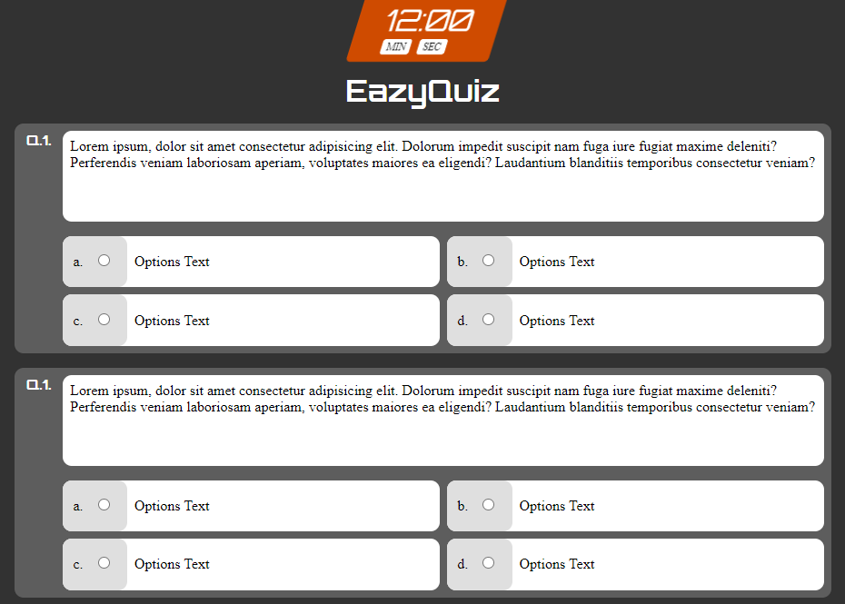

# Simple Javascript Quiz ([Demo](https://softon.github.io/js-quiz/))

A simple javascript quiz web app using HTML/CSS/Javascript UI designed using Figma.

## Flow
- User enters the name to begin
- A timer starts and 5 random questions are selected from the list of questions.
- User submits the quiz 
- Result of Pass/Fail is displayed.

## Tutorial Videos
- **Part 1** : Comming soon
- **Part 2** : Comming soon